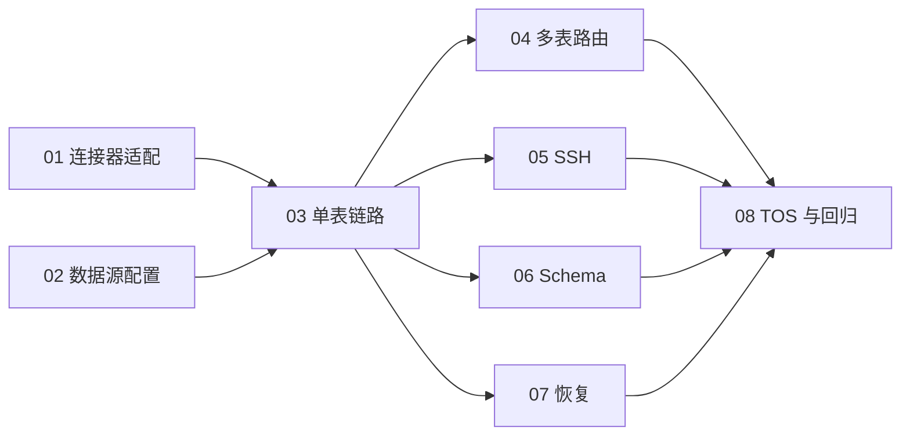

# Issue #1：Paimon 实时同步任务索引

父需求：[feat: 支持 Paimon 作为实时同步目标端](https://github.com/201811510411lw/yak-ops/issues/1)。

实施基线：[规格](../architecture/PAIMON_REALTIME_SYNC_SPEC.md)。依赖证据：[兼容性研究](../research/issue-1-paimon-compatibility.md)。

固定选择：Flink 1.20.5、Yak 使用的 Flink CDC 3.6.0 YAML Pipeline、Paimon 2.0.0、filesystem Catalog、标准 S3 兼容接口；TOS 是首个真实验收目标。连接器版本差异在任务 01 中适配。

这里是随仓库版本管理的任务清单，尚未发布为 GitHub 子 Issue。每个文件可供一个独立实现会话使用；当前均未实施。`ready-for-agent` 表示任务内容完整，可开工还要求 Blocked by 全部完成。

## 任务与依赖

| 编号 | 任务 | Blocked by | 完成时可验证的结果 |
| --- | --- | --- | --- |
| [01](issues/01-runtime-connector.md) | build: 适配 CDC 3.6 的 Paimon 2.0 运行产物 | 无 | 指定版本可复现构建，并在隔离环境跑通单表全量和增删改 |
| [02](issues/02-datasource.md) | feat: 支持 Paimon S3 数据源配置与连接测试 | 无 | 从页面保存、编辑并只读测试 Paimon 连接，凭据安全回显 |
| [03](issues/03-single-table.md) | feat: 打通单表 Paimon 实时同步 | 01、02 | 向导/YAML → 发布 → LOCAL 提交 → 新表全量和增删改 |
| [04](issues/04-multi-table.md) | feat: 支持多表路由与 Paimon 表属性 | 03 | 多表一对一同步，复合主键及 bucket/分区策略可配置并核验 |
| [05](issues/05-ssh.md) | feat: 支持 SSH 提交 Paimon 同步任务 | 03 | 远程能力检查、提交、日志和凭据清理可验证 |
| [06](issues/06-schema.md) | feat: 支持受限 Schema Evolution | 03 | 允许的 DDL 生效，禁止的 DDL 在目标变更前明确失败 |
| [07](issues/07-recovery.md) | fix: 验证 Paimon 故障恢复与重复提交保护 | 03 | checkpoint 恢复后数据正确，提交不确定时不重复作业 |
| [08](issues/08-tos-release.md) | test: 完成 TOS 联调与 JDBC 回归验收 | 04、05、06、07 | 真实 TOS 组合场景和完整构建回归有可复查证据 |

依赖图：

当前可开工：**01、02**。依赖满足的任务可以独立推进；涉及共享接口的并行修改需协调。每个实现会话从对应 ticket 和规格开始，完成后记录验证证据，再更新任务状态。

## 验收覆盖

| 规格门槛 | 主责任务 | 集成复验 |
| --- | --- | --- |
| G0 版本产物 | 01 | 03、08 |
| G1 数据源与凭据 | 02 | 03、05、08 |
| G2 非 JDBC 模型 | 02、03 | 08 |
| G3 编译与 UI | 03、04 | 06、08 |
| G4 提交与环境 | 03、05 | 08 |
| G5 数据正确性 | 03、04 | 08 |
| G6 Schema | 03（FAIL）、06（有限 EVOLVE） | 08 |
| G7 故障恢复 | 07 | 08 |
| G8 生命周期 | 03、07 | 08 |
| G9 JDBC 与构建回归 | 每个任务对自身修改负责 | 08 |

## 完成标准

- 每项任务先核对自身验收项，再评审完整 diff，执行与该切片相关的项目构建和行为测试；已有/环境失败保留证据。
- 01 的隔离 S3 验证可使用兼容测试服务；02–07 可在隔离环境推进。08 必须使用可访问的 Flink 和独立 TOS 测试目标，缺失真实凭据/环境时标记未验收。
- 06 的有限 EVOLVE 属于完整交付要求；首个切片仅支持 FAIL 不等于可以关闭父需求。
- TaskManager 故障恢复和平台 Restart/Apply 是不同能力。首期不新增未经设计的 savepoint 管理；不支持的操作须在停止健康实例前明确拒绝。
- 全部 8 项完成并满足 G0–G9 后，才具备报告 Issue 验收完成的证据。提交、推送、发布和外部 Issue 操作按当次授权执行。
